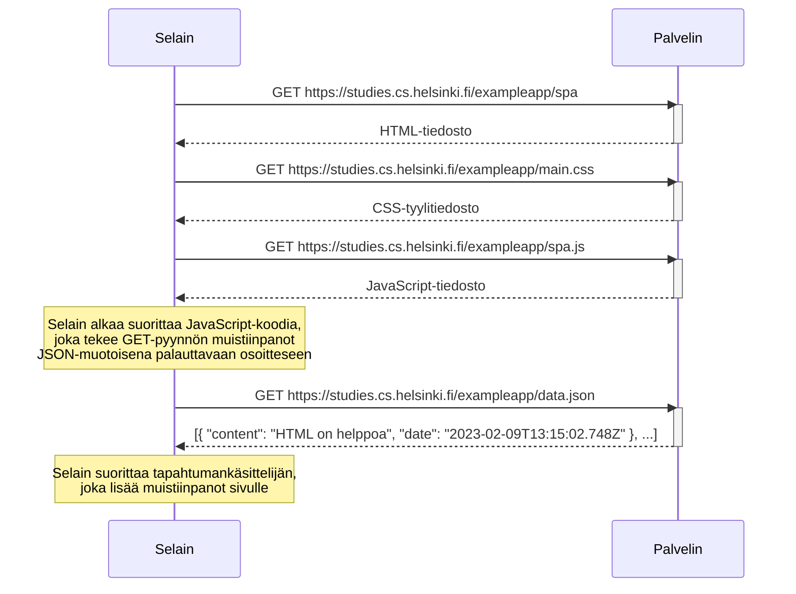

```mermaid
sequenceDiagram
    participant Selain
    participant Palvelin

    Selain->>Palvelin: GET https://studies.cs.helsinki.fi/exampleapp/spa
    activate Palvelin
    Palvelin-->>Selain: HTML-tiedosto
    deactivate Palvelin
    
    Selain->>Palvelin: GET https://studies.cs.helsinki.fi/exampleapp/main.css
    activate Palvelin
    Palvelin-->>Selain: CSS-tyylitiedosto
    deactivate Palvelin

    Selain->>Palvelin: GET https://studies.cs.helsinki.fi/exampleapp/spa.js
    activate Palvelin
    Palvelin-->>Selain: JavaScript-tiedosto
    deactivate Palvelin
    
    Note over Selain: Selain alkaa suorittaa JavaScript-koodia,<br/>joka tekee GET-pyynnön muistiinpanot<br/>JSON-muotoisena palauttavaan osoitteseen 
    
    Selain->>Palvelin: GET https://studies.cs.helsinki.fi/exampleapp/data.json
    activate Palvelin
    Palvelin-->>Selain: [{ "content": "HTML on helppoa", "date": "2023-02-09T13:15:02.748Z" }, ...]
    deactivate Palvelin    

    Note over Selain: Selain suorittaa tapahtumankäsittelijän,<br/>joka lisää muistiinpanot sivulle
```