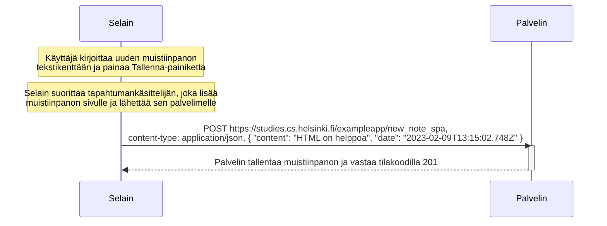

```mermaid
sequenceDiagram
    participant Selain
    participant Palvelin

    Note over Selain: Käyttäjä kirjoittaa uuden muistiinpanon<br/>tekstikenttään ja painaa Tallenna-painiketta
    Note over Selain: Selain suorittaa tapahtumankäsittelijän, joka lisää<br/> muistiinpanon sivulle ja lähettää sen palvelimelle
    Selain->>Palvelin: POST https://studies.cs.helsinki.fi/exampleapp/new_note_spa,<br/>content-type: application/json, { "content": "HTML on helppoa", "date": "2023-02-09T13:15:02.748Z" }
    activate Palvelin
    Palvelin-->>Selain: Palvelin tallentaa muistiinpanon ja vastaa tilakoodilla 201
    deactivate Palvelin
```